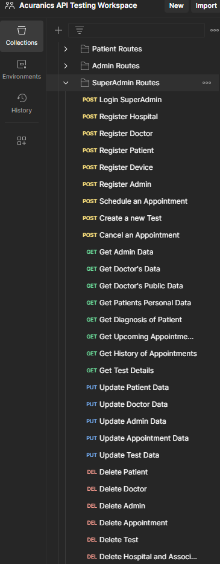
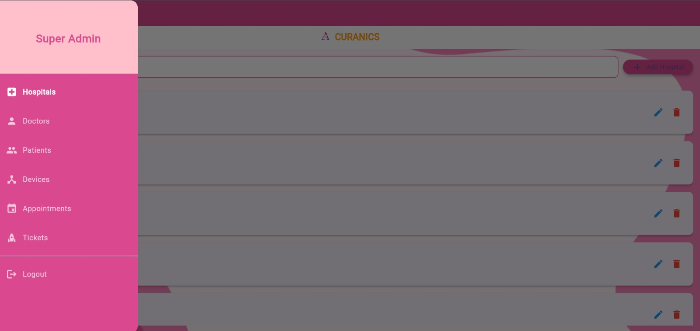
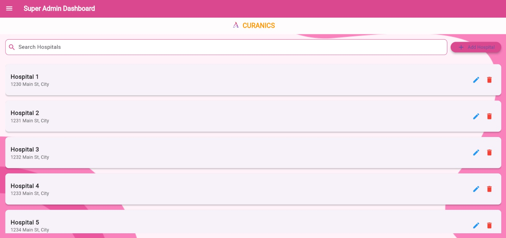
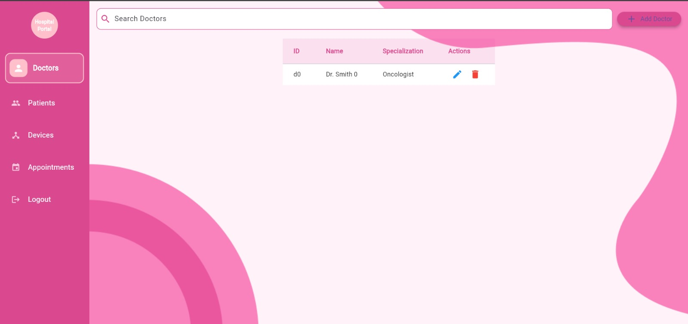
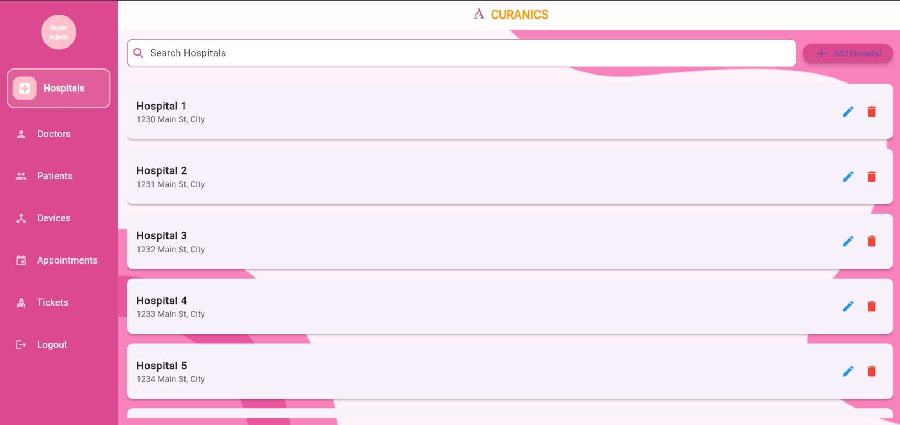

# Acuranics - Nirvesh Enterprises 
A Platform for the study and detection of breast cancer

## Developers

- Front-end team: El-Ghoul Layla, Mahmoud Abdelrahman  
- Back-end team: Sakka Mohamad-Mario, Zafar Azzam

## Architecture

- There's one superadmin who has control over the entire database and platform.
- Hospitals or clinics get registered on the platform by the superadmin, each hospital has some admins who oversee the activities of doctors and their interactions with patients.
- Patients and Doctors have to be registered by admins or the superadmin in order to have access to the platform.
- Patients can schedule appointments, cancel or re-schedule appointments through the platform.
- Doctors can also schedule appointments with their patients, cancel or re-schedule them.
- Specialized devices for studying tumors are worn by patients. These devices transmit raw data to a remote server where it will be processed, afterwards it can be retrieved by doctors or patients and displayed in auto-generated graphics and statistics.

## Updates Log
### 03/01/2025

- Implemented the routes, controllers, and services necessary for registering, deleting, updating, suspending or fetching data from the DB and created http request examples in Postman, that can be used by the superadmin  

- We changed the navbar from a popout to a persistent navbar and we orginzaed the stuctre more and added animation  
Before:  
After:  

